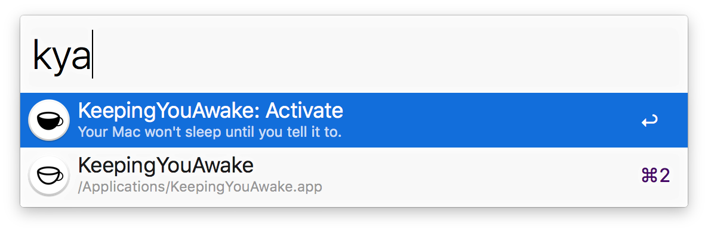

# alfred-keepingyouawake

> [Alfred 3](https://www.alfredapp.com/) workflow for toggling [KeepingYouAwake](https://github.com/newmarcel/KeepingYouAwake), a Caffeine clone for macOS.

## Install

1. [Install KeepingYouAwake](https://github.com/newmarcel/KeepingYouAwake#installation).
2. Install the workflow.

Requires the Alfred [Powerpack](https://www.alfredapp.com/powerpack/).

## Usage

In Alfred, type `kya` and `Enter` to toggle whether or not your Mac is allowed to sleep.

## License

MIT © [Tyler Sticka][http://tylersticka.com/]
